# 📱 AnuFy App Architecture & System Design
> **Comprehensive Technical & Narrative Guide**
> *Documenting the "Brain" of the AnuFy Social Platform*

---

## 📖 1. The "Oral" Tour: How AnuFy Works
*Imagine the backend as a bustling metropolis...*

### 🏙️ The City Analogy
*   **The Users (The Cars)**: Millions of users are the traffic trying to enter the city (the App).
*   **The API Gateway (Traffic Control)**: This is the entry point. Every request is stopped at the gate (`Auth Middleware`). The guard checks the ID badge (`JWT Token`). No ID? No entry.
*   **The Controller (The Dispatcher)**: Once inside, the Dispatcher (`Routes`) looks at the request package. "Oh, this is a Comment? Send it to the Comment Department."
*   **The Service Layer (The Workers)**: These are the experts. The Comment Worker checks the rules: "Did they mention anyone? Is this a reply?" They prepare the work.
*   **The Database (The Warehouse)**: This is `MongoDB`. It's where we store everything forever. The Workers file the paperwork here.
*   **The Queue (The Express Lane)**: Sometimes, tasks are too heavy (like sending 10,000 notifications). Instead of blocking traffic, we toss these tasks onto a conveyor belt (`Redis Queue`).
*   **The Background Workers (Night Shift)**: These workers pick items off the conveyor belt and handle them quietly in the background, ensuring the main traffic never jams.

---

## 🗺️ 2. System Architecture (Visual Graph)

This diagram shows how the physical components of your server talk to each other.

```mermaid
graph TD
    Client[📱 Mobile App / Web]
    
    subgraph "🚧 The Gatekeepers"
        LB[Load Balancer]
        Auth[🔐 Auth Guard (JWT)]
    end
    
    subgraph "🧠 The Brain (API Server)"
        Router[🚦 Router]
        Service[⚙️ Business Logic]
    end
    
    subgraph "📦 The Warehouse (Storage)"
        Mongo[(🗄️ MongoDB Primary)]
        Redis[(⚡ Redis Cache)]
    end
    
    subgraph "🚚 The Logistics (Async Workers)"
        Queue[📨 BullMQ Queue]
        Worker1[👷 Like Worker]
        Worker2[📢 Notification Worker]
        Worker3[💬 Chat Worker]
    end

    Client -->|1. Request| LB
    LB --> Auth
    Auth --> Router
    Router --> Service
    
    Service -->|2. Save Data| Mongo
    Service -->|3. Cache Hot Data| Redis
    Service -->|4. Delegate Heavy Task| Queue
    
    Queue -->|5. Process Job| Worker1
    Queue -->|6. Process Job| Worker2
    
    Worker1 -->|7. Update Stats| Mongo
    Worker2 -->|8. Send Push| Client
```

---

## 🔗 3. Data Connections & Navigation

How does the app know where to go? It follows the **Data Links**.

### 🧭 The Navigation Flow
When a user taps something in the app, the backend provides the map coordinates.

1.  **Tap on a Comment Author**:
    *   **Data Source**: `Comment` object contains `user: { _id, username }`.
    *   **Action**: App navigates to `/profile/:username`.
    *   **Backend**: `GET /api/users/username/:username` fetches the full profile.

2.  **Tap on "View Replies"**:
    *   **Data Source**: `Comment` object has `replies_count`.
    *   **Action**: App calls `GET /api/comments/:id/replies`.
    *   **Backend**: Fetches all comments where `parent_comment_id` matches the clicked comment.

3.  **Tap on a Notification**:
    *   **Data Source**: `Notification` object has `data: { postId, type: 'comment' }`.
    *   **Action**: App reads `type` and navigates to the specific `Post`.
    *   **Backend**: `GET /api/posts/:postId` fetches the post to display.

---

## 🧬 4. The Core Data Graph (Entity Relationships)

This "Map" shows how every piece of data connects to another.

```mermaid
classDiagram
    %% Relationships
    User "1" --> "*" Post : Creates 📸
    User "1" --> "*" Comment : Writes ✍️
    User "1" --> "*" Like : Reacts ❤️
    User "1" --> "*" Follow : Follows 👣
    User "1" --> "*" Message : Sends 📨
    
    Post "1" --> "*" Comment : Contains
    Post "1" --> "*" Like : Receives
    
    Comment "1" --> "*" Comment : Replies to (Parent)
    
    %% Class Definitions
    class User {
        +ObjectId _id
        +String username
        +String email
        +Boolean is_verified
        +Boolean isAnonymousMode
    }
    
    class Post {
        +ObjectId user_id
        +String[] media_urls
        +Number likes_count
        +Number comments_count
        +String[] hashtags
    }
    
    class Comment {
        +ObjectId post_id
        +ObjectId user_id
        +ObjectId parent_comment_id
        +String content
        +String[] mentions
    }
    
    class Like {
        +ObjectId user_id
        +ObjectId post_id
        +String content_type (Post/Reel/Comment)
    }
```



## 🎨 5. Detailed Feature Visualizations

Here are visual breakdowns of complex internal logic.

### 🔐 Authentication Flow (Login)
How a user gets their "ID Badge" (JWT Token).


### 🗣️ Comment Flattening Logic
How we turn a deep "staircase" of replies into a clean 1-level list (Instagram Style).


### 📢 Notification Routing System
How a single action triggers a push notification to a specific device.

```mermaid
flowchart LR
    Event[Action: Like/Comment] --> API[API Server]
    API -->|Add Job| Q{Redis Queue}
    
    Q -->|Job: 'notification'| Worker[Notification Worker]
    
    Worker -->|1. Fetch User| DB[(MongoDB)]
    DB -- Push Token --> Worker
    
    Worker -->|2. Construct Msg| Expo[Expo Push Service]
    Expo -->|3. Send| Device[User's Phone 📲]
```



---

## 📕 6. The Visual Dictionary: Models & Fields

Here is the blueprint of your data objects, visualized as engineering diagrams.

### 👤 User Model
*The Identity of a person.*


### 📸 Post & Reel Models
*The Content people see.*


### 💬 Comment Model
*The Interactions.*


### ❤️ Like & Notification Models
*The Reactions & Alerts.*


## 🛡️ 7. Data Integrity & Duplicate Prevention

How we ensure `User A` can't like `Post B` twice, even if they tap the button 100 times.

### 🛑 The Database "Bouncer" (Unique Indexes)
We set strict rules at the database level. If a duplicate tries to enter, MongoDB throws an error (`Code 11000`).

```mermaid
graph LR
    Input[Insert Request] --> Check{Unique Index?}
    Check -- No Duplicate --> DB[(Database)]
    Check -- Duplicate Found --> Error[❌ Error 11000]
    
    style Error fill:#ff9999,stroke:#333
    style DB fill:#99ff99,stroke:#333
```



### ♻️ The Idempotent Worker (Graceful Handling)
When a user spams the "Like" button, our Worker catches the error and ignores it, keeping the data clean without crashing.


---

## 📈 8. System Scalability & Performance

What happens *millisecond-by-millisecond* when you hit "Like"?

```mermaid
sequenceDiagram
    participant App as 📱 Mobile App
    participant API as 🚦 API Server
    participant DB as 🗄️ MongoDB
    participant Q as 📨 Queue (Redis)
    participant Worker as 👷 Background Worker
    
    Note over App: User taps "Like" ❤️
    
    App->>API: POST /api/comments/123/like
    API->>API: 🔐 Check Auth Token
    
    par Optimistic Response
        API->>Q: 📤 Add Job: "like-comment"
        API-->>App: ✅ 200 OK (User sees red heart instantly)
    end
    
    Note over Worker: 1 Second Later...
    
    Q->>Worker: 📨 Pick up job
    Worker->>DB: 💾 Save "Like" Document
    Worker->>DB: 🔢 Increment comments.likes_count +1
    Worker->>Q: 📤 Add Job: "send-notification"
```



---

## 🛠️ 7. API Capabilities

Your backend exposes these "Knobs and Levers" for the frontend to use.

### **Authentication**
*   `POST /auth/login` -> Returns `accessToken` (The ID Badge).
*   `POST /auth/register` -> Creates new User.

### **Content**
*   `GET /posts/feed` -> The "Home" screen. Infinite scroll.
*   `GET /explore` -> The "Search" screen. Trending algorithms.

### **Social Graph**
*   `POST /users/:id/follow` -> Follows a user.
*   `GET /users/:id/followers` -> See who follows them.

### **Interactions**
*   `POST /comments` -> Write a comment.
*   `DELETE /comments/:id` -> Remove a comment.
*   `POST /comments/:id/like` -> Like a comment (Async).

---

## � 8. Performance Features
*   **Rate Limiting**: Prevents bots from spamming comments (Max 15/min).
*   **Pagination**: Only loads 20 comments at a time to save data.
*   **Indexes**: Database "Shortcuts" that make searching for `@username` instant.
*   **Flattened Replies**: Prevents "infinite staircase" comments, keeping the UI clean (1 level deep).
