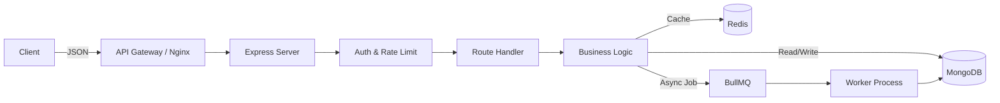
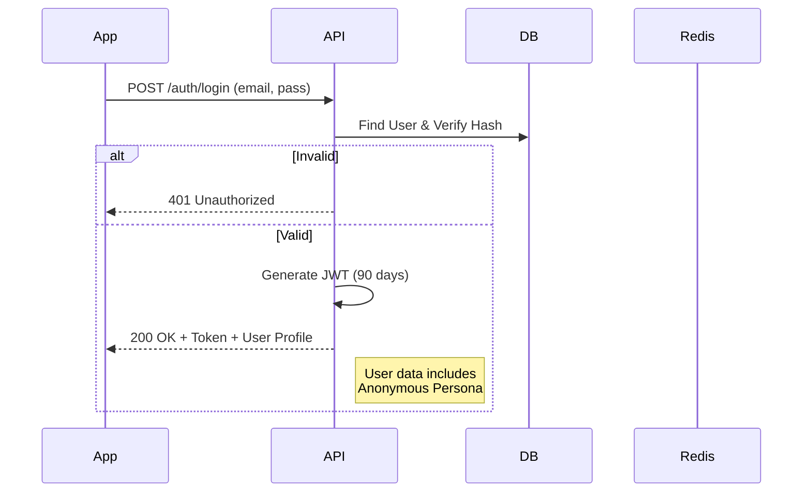
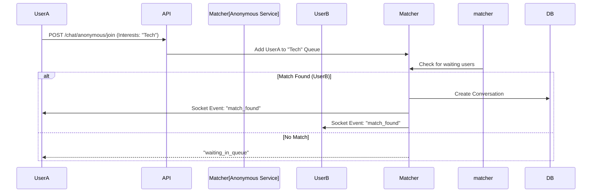

# Backend Documentation - AufyBackend

## 1. Project Overview
**AufyBackend** is a comprehensive, high-performance social media backend designed to power a modern, feature-rich mobile application. It handles everything from basic user identity to complex realtime interactions, supporting a dual-identity system (Standard & Anonymous) that is unique to this platform.

*   **Type**: Social Media Platform (Hybrid: Public Feed + Private Anonymous Chat)
*   **Users**: 
    *   **Creators/Users**: Share posts, reels, stories, and chat.
    *   **Admins**: Content moderation and system management.
*   **Core Responsibilities**:
    *   **Identity Management**: Secure JWT auth with anonymous persona switching.
    *   **Content Delivery**: Personalized feeds for Posts, Reels, and Stories (Close Friends 2.0).
    *   **Realtime Engagement**: Socket-based chat, instant notifications, and live queues.
    *   **Scalability**: Async processing for likes/views to handle viral load.

## 2. Technology Stack

| Component | Technology | Description |
| :--- | :--- | :--- |
| **Language** | TypeScript (Node.js v18+) | Strictly typed backend logic |
| **Framework** | Express.js | REST API architecture |
| **Database** | MongoDB (Mongoose) | Primary data store (User, Post, Chat) |
| **Caching** | Redis (IOredis) | Feed caching, session store, rate limiting |
| **Queues** | BullMQ | Async job processing (Likes, Notifications) |
| **Realtime** | Socket.io + Firebase | Bidirectional communication & Push Notifs |
| **Search** | ElasticSearch (Planned) | User and content search |
| **Storage** | Cloudinary | Media optimization and storage |
| **Auth** | JWT + BCrypt | Stateless secure authentication |
| **Monitoring** | Prometheus + Grafana | Performance metrics |

## 3. Backend Architecture
The project follows a **Modular Service-Oriented Monolith** architecture. 
*   **Modular**: Features are grouped by domain (e.g., `services/post.ts`, `routes/posts.ts`).
*   **Service-Repository Pattern**: Controllers (Routes) delegate logic to Services, which interact with the DB.

### Request Lifecycle


## 4. Data Flow Graphs

### 4.1. User Login & Session


### 4.2. Anonymous Chat Queue (Realtime)


## 5. Database Design
Below is the schema definition for the primary models in `src/models`.

### Core Models

#### **1. User (`user.ts`)**
*   **Purpose**: Stores identity, profile, and settings.
*   **Key Fields**:
    *   `username`, `email`, `password`: Auth credentials.
    *   `is_anonymous_mode`: Boolean toggle for current state.
    *   `anonymous_persona`: Object `{ name, avatar }` for masked identity.
    *   `is_verified`, `badge_type`: Status indicators.
*   **Indexes**: `email` (unique), `username` (unique).

#### **2. Post (`post.ts`)**
*   **Purpose**: Standard feed content.
*   **Key Fields**:
    *   `user_id`: Reference to User.
    *   `media_urls`: Array of strings (images/videos).
    *   `is_anonymous`: Stores if post was made in anonymous mode.
    *   `location`: `{ lat, lng, name }`.
*   **Relations**: Has many Comments, Likes.

#### **3. Reel (`reel.ts`)**
*   **Purpose**: Short-form vertical video content.
*   **Key Fields**:
    *   `video_url`: Primary media.
    *   `views_count`, `shares_count`: Engagement metrics.
    *   `is_archived`: Soft delete status.

#### **4. Story (`story.ts`)**
*   **Purpose**: Ephemeral content (24h).
*   **Key Fields**:
    *   `media_type`: 'image' or 'video'.
    *   `share_type`: 'your-story' or 'close-friends'.
    *   `expires_at`: Date field for TTL index (auto-delete).
    *   `remix_changes`: Stores modifications if remixed.

#### **5. Conversation (`conversation.ts`)**
*   **Purpose**: Chat rooms.
*   **Key Fields**:
    *   `type`: 'direct' or 'group'.
    *   `participants`: Array of `{ user_id, role, joined_at }`.
    *   `is_anonymous`: Critical flag for anonymous chat feature.
    *   `last_message`: Ref to Message for listing preview.

### ER Diagram
```mermaid
erDiagram
    USER ||--o{ POST : creates
    USER ||--o{ REEL : uploads
    USER ||--o{ STORY : shares
    USER ||--o{ CONVERSATION : joins
    
    CONVERSATION ||--|{ MESSAGE : contains
    POST ||--|{ COMMENT : receives
    POST ||--|{ LIKE : receives
    
    STORY }|--|| USER : original_creator (Remix)
```

## 6. API Documentation
The API is organized into RESTful modules under `/api`.

### **Auth Module (`/api/auth`)**
| Method | Endpoint | Description | Auth |
| :--- | :--- | :--- | :--- |
| `POST` | `/login` | Email/Password login. Returns JWT. | No |
| `POST` | `/register` | Create new account. | No |
| `POST` | `/refresh` | Refresh expired access token. | Yes |

### **Posts Module (`/api/posts`)**
| Method | Endpoint | Description | Auth |
| :--- | :--- | :--- | :--- |
| `GET` | `/feed` | Get personalized main feed. | Yes |
| `POST` | `/` | Create a new post. | Yes |
| `POST` | `/:id/like` | Async like action. | Yes |
| `GET` | `/:id` | Get single post details. | Optional |

### **Chat Module (`/api/chat`)**
| Method | Endpoint | Description | Auth |
| :--- | :--- | :--- | :--- |
| `GET` | `/conversations` | List user's chats. | Yes |
| `POST` | `/anonymous/join` | Join random chat queue. | Yes |
| `POST` | `/anonymous/skip` | Skip current stranger & find next. | Yes |
| `GET` | `/anonymous/count` | Get number of users online in topic. | No |

### **Users Module (`/api/users`)**
| Method | Endpoint | Description | Auth |
| :--- | :--- | :--- | :--- |
| `GET` | `/me` | Get own profile. | Yes |
| `GET` | `/profile/:username` | Get public profile. | Optional |
| `POST` | `/anonymous/toggle` | Switch between Real/Anon mode. | Yes |
| `POST` | `/anonymous/persona` | Customize anonymous avatar/name. | Yes |

### **Notifications Module (`/api/notifications`)**
| Method | Endpoint | Description | Auth |
| :--- | :--- | :--- | :--- |
| `GET` | `/` | Get list of notifications. | Yes |
| `POST` | `/mark-read` | Mark notifications as read. | Yes |

### **Reels Module (`/api/reels`)**
| Method | Endpoint | Description | Auth |
| :--- | :--- | :--- | :--- |
| `GET` | `/feed` | Get algorithmic reel feed. | Yes |
| `POST` | `/upload` | Upload new reel. | Yes |

## 7. Authentication & Authorization
*   **JWT Strategy**: The server issues a signed JWT containing `userId` and `username`.
*   **Middleware (`auth.ts`)**:
    *   **authenticateToken**: Blocks unauthenticated requests. Returns 401.
    *   **optionalAuth**: Allows request but attaches `req.user` if token is present (useful for public posts).
*   **Security**: Passwords are hashed with `bcryptjs`. Tokens have a 90-day expiry.

## 8. Core Features Explained

### **Anonymous Mode**
*   **Why**: Users want to express themselves freely without social pressure.
*   **How**: 
    1.  User toggles switch -> API updates `is_anonymous_mode` in DB.
    2.  When posting/commenting, the backend checks this flag.
    3.  If true, the content is saved with `is_anonymous: true`.
    4.  **Egress Masking**: When fetching feeds, the `maskAnonymousUser` utility replaces the real user profile with the `anonymousPersona` (e.g., "Mystery Fox").

### **Close Friends 2.0**
*   **Why**: Granular privacy.
*   **How**: Stories have a `share_type`. The feed algorithm filters stories based on whether the viewer is in the creator's "Close Friends" list (stored in `close-friend.ts`).

## 9. Algorithms & Logic 🧠

### **1. The "Fan-Out" Feed Algorithm (Hybrid)**
We use a **Pull + Push** hybrid model to serve feeds instantly.
*   **Pull (Regular Users)**: When a user requests `/feed`, we query the database for posts from people they follow, sorted by `created_at`.
*   **Push (Celebrities/Viral)**: For users with <10k followers, we "fan out" their new posts to all followers' Redis lists (`feed:{userId}`). This allows O(1) read time.
*   **Discovery Engine**: The `getAnonymousTrendingFeed` uses a scoring system:
    *   `Score = (Likes * 1) + (Comments * 2) + (Shares * 3) / (TimeDecay^1.5)`
    *   This ensures fresh, high-engagement content bubbles to the top.

### **2. Reel Recommendation Engine**
*   **Logic**:
    1.  **Candidate Generation**: Fetch 500 recent reels.
    2.  **Filtering**: Remove watched reels (bloom filter).
    3.  **Ranking**: Sort by `view_completion_rate` (how much of the video was watched).
    4.  **Interleaving**: Mix in 20% "Explore" content (new creators) to prevent echo chambers.

## 10. Advanced Security Features �️

### **1. Multi-Layer Protection**
*   **Helmet.js**: Sets 12+ secure HTTP headers (HSTS, No-Sniff, XSS-Filter).
*   **CORS**: Strict allowlist in production, blocking unauthorized domains.
*   **NoSQL Injection**: `mongo-sanitize` strips `$` and `.` from all inputs to prevent query hacking.

### **2. Granular Rate Limiting (Redis-Backed)**
Instead of a global limit, we have specific "buckets" per user:
*   **Auth**: 10 attempts / 15 mins (Brute force protection).
*   **Posts**: 5 posts / minute (Spam prevention).
*   **Likes**: 100 likes / minute (Bot prevention).
*   **Follows**: 500 follows / day (Growth hacking prevention).

### **3. Content Safety**
*   **XSS Stripping**: All text inputs run through an XSS sanitizer before saving.
*   **Identity Masking**: The `maskAnonymousUser` function ensures the real `user_id` of an anonymous poster is **NEVER** sent to the client, preventing reverse-engineering of identity.

## 11. Hero Features �🚀

### **1. Async Like Architecture**
To handle "Justin Bieber scale" traffic:
1.  User taps Like -> API returns 200 OK immediately (Optimistic UI).
2.  Backend pushes job to `likes-queue` (Redis).
3.  **Worker** picks up job -> Checks DB for duplicates -> Inserts Like -> Updates Counter -> Sends Notification.
4.  **Result**: 10ms API response time regardless of DB load.

### **2. Random Anonymous Chat**
A sophisticated matching engine:
1.  Users specify "Interests" (e.g., Anime, Tech).
2.  `AnonymousChatService` places them in a Redis Set.
3.  When a second user joins, the service instantly pairs them, creates a `Conversation` with `is_anonymous: true`, and emits socket events to connect them peer-to-peer.

## 12. Performance & Scaling
*   **Database**: Heavy use of compound indexes (e.g., `user_id` + `created_at` for feeds).
*   **Caching Strategy**: 
    *   **L1**: Redis Cache for User Profiles (very high hit rate).
    *   **L2**: Redis Cache for Feed Pages (TTL 2 minutes).
*   **Pagination**: All list endpoints support `limit` and `cursor/skip`.

## 13. Environment Configuration
Required variables in `.env`:
*   `MONGODB_URI`: Production DB string.
*   `REDIS_URL`: For BullMQ and Caching.
*   `JWT_SECRET`: Signing key.
*   `PORT`: Defaults to 5000.

## 14. Error Handling
Global error middleware in `middleware/errorHandler.ts` catches async errors.
**Format**:
```json
{
  "success": false,
  "message": "User not found",
  "code": 404
}
```

## 15. How to Run Locally
1.  **Clone & Install**:
    ```bash
    git clone <repo>
    npm install
    ```
2.  **Databases**: Ensure MongoDB and Redis are running locally.
3.  **Env**: Copy `.env.example` to `.env`.
4.  **Run**:
    ```bash
    npm run dev
    ```
5.  **Test**: Open `http://localhost:5000/api/posts/feed`.

## 16. Future Improvements
*   **Neo4j Migration**: For faster social graph queries (e.g., "Followers of Followers").
*   **Microservices**: Split the `ChatService` into a dedicated WebSocket server.
*   **AI Content Moderation**: Integrate OpenAI to auto-flag toxic anonymous messages.
